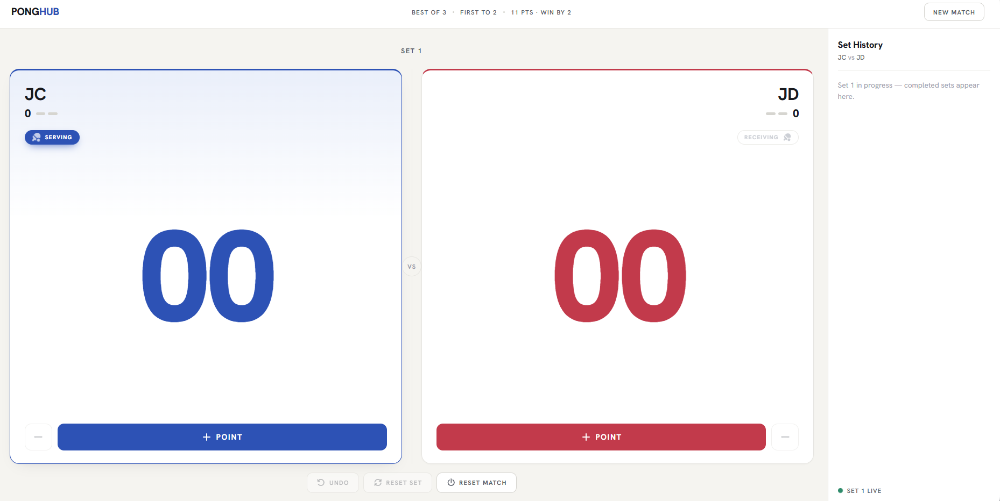
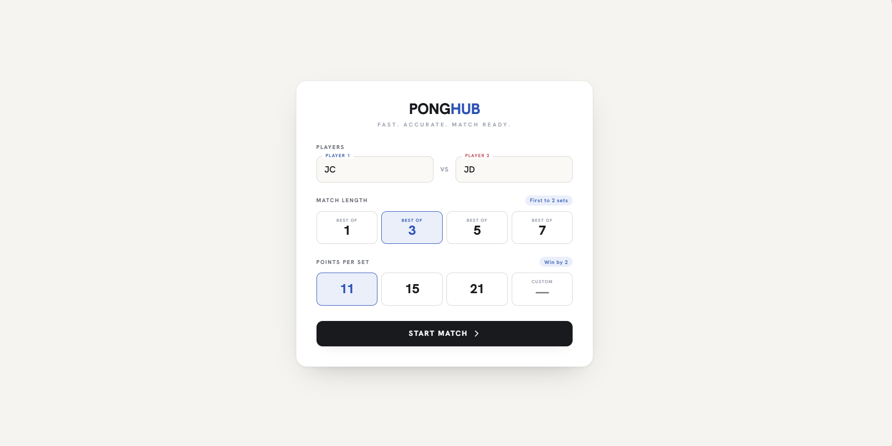
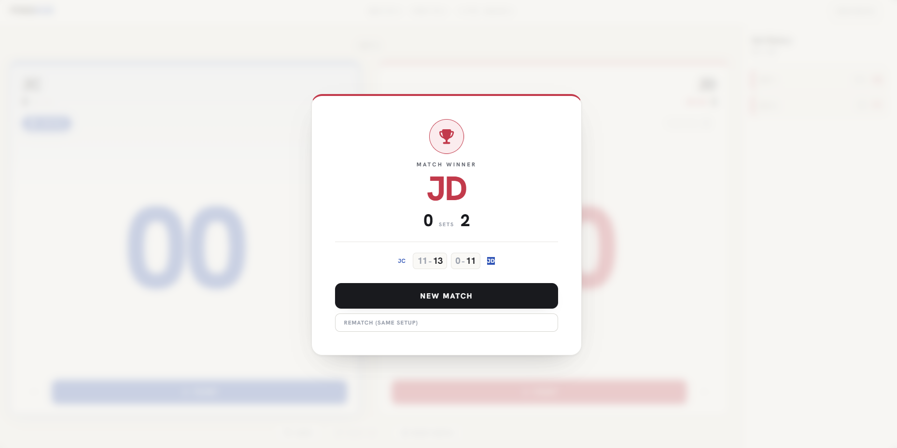
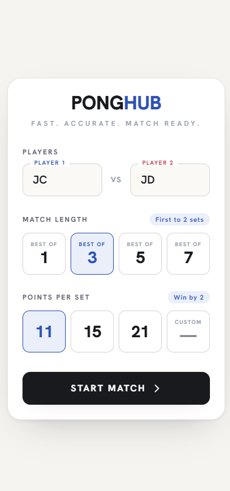
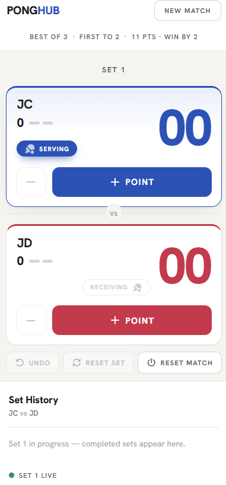
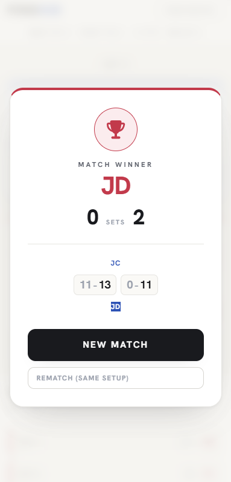

<div align="center">

# 🏓 PongHub

### Fast. Accurate. Match Ready.

A table tennis scoreboard for the web — real match rules, automatic set handling, and a clean broadcast-style display that puts the score front and centre.

<br/>


<br/>



</div>

---

## Overview

PongHub is a single-purpose scoring app — no landing page, no dashboard clutter. You enter the players and format, then you score. The interface enforces the official table tennis rules so the scorer never has to think about win-by-two, set boundaries, or who has clinched the match — it just tells you.

State lives in the URL-free, refresh-proof way: every match is mirrored to `localStorage`, so closing the tab mid-rally doesn't lose the score.

## Features

| | |
|---|---|
| 🎯 **Match setup** | Player names, **Best of 1 / 3 / 5 / 7** (auto-derives "first to *N* sets"), and a set target of **11 / 15 / 21** or any custom value. |
| 🏓 **Real rules** | Win-by-two is enforced automatically — `10–10` keeps going to `12–10`, `13–11`, and so on. |
| 🔢 **Dominant scoreboard** | Stadium-sized numerals in each player's colour; the score is always the focal point. |
| 🔁 **Automatic sets** | Winning a set banks the result, bumps the set count, and resets points for the next one. |
| 🥇 **Winner detection** | The moment a player reaches the required sets, the trophy screen appears with the full set-by-set summary. |
| 🟦 **Serve indicator** | A bold **Serving / Receiving** badge follows correct table tennis rotation (every 2 points, every 1 at deuce). |
| ⏮️ **Undo & resets** | Full undo stack, plus *Reset Set* and a confirm-guarded *Reset Match*. |
| 🗂️ **Set history** | A running panel of every completed set, reviewable at a glance. |
| 📱 **Responsive** | Broadcast layout on desktop → stacked, touch-first cards on mobile, with no loss of function. |
| 💾 **Persistent** | Matches survive refreshes via `localStorage`. |

## Previews

<div align="center">

**Match setup**



**Live match**


**Match winner**



**Mobile** — setup · live match · winner

<table>
  <tr>
    <td></td>
    <td></td>
    <td></td>
  </tr>
</table>

</div>

## Quick start

> Requires [Bun](https://bun.sh) `1.3+`.

```bash
# install dependencies
bun install

# start the dev server
bun run dev

# production build + type-check
bun run build

# preview the production build
bun run preview

# lint
bun run lint
```

The dev server runs at `http://localhost:5173/PongHub/`.

## How scoring works

All match logic is pure and isolated in [`src/match/logic.ts`](src/match/logic.ts), which keeps it testable and the UI dumb.

```ts
setsToWin(bestOf)        // 3 → 2, 5 → 3, 7 → 4
isSetWon(a, b, target)   // a >= target && a - b >= 2   (win by two)
isSetPoint(a, b, target) // one point away from taking the set
isDeuce(a, b, target)    // both within the win-by-two zone
currentServer(...)       // serve rotation, incl. the deuce switch
```

A few situations the board surfaces automatically:

- **Deuce** — both players reach `target − 1` (e.g. `10–10`), service switches every point.
- **Set point / Match point** — flagged per player *and* in the centre banner.
- **Advantage** — shown by name when a player edges ahead during deuce.

Undo is implemented as a snapshot stack in the reducer ([`src/match/MatchContext.tsx`](src/match/MatchContext.tsx)) — every scoring action pushes the prior state, so you can step back across set boundaries cleanly.

## Tech stack

- **React 19** + the React Compiler, function components and hooks throughout
- **TypeScript** in strict mode (`noUnusedLocals`, `verbatimModuleSyntax`)
- **Vite 8** (Rolldown) for dev/build
- **Context API + `useReducer`** for match state — no external store needed
- **Font Awesome** (SVG core) for iconography
- **Bun** as package manager and runtime

## Project structure

```text
src/
├─ main.tsx                 # entry — mounts <App/>, configures Font Awesome
├─ App.tsx                  # routes between Setup, Scoreboard, Winner
├─ index.css                # design tokens + reset
├─ ponghub.css              # all component styling
├─ components/
│  ├─ MatchSetup.tsx        # pre-match configuration
│  ├─ Scoreboard.tsx        # live match shell (topbar, court, history)
│  ├─ PlayerPanel.tsx       # one player: name, sets, serve badge, score, controls
│  ├─ ControlPanel.tsx      # undo / reset set / reset match
│  ├─ SetHistory.tsx        # completed-set list
│  └─ WinnerModal.tsx       # trophy + final summary
└─ match/
   ├─ types.ts              # domain types
   ├─ logic.ts              # pure scoring rules
   └─ MatchContext.tsx      # reducer, undo stack, persistence
```

## Deployment

The app builds with a base path of `/PongHub/` (see [`vite.config.ts`](vite.config.ts)), ready for project-pages hosting such as GitHub Pages:

```bash
bun run build      # outputs to dist/
```

Serve `dist/` from a host mounted at `/PongHub/`. If you deploy somewhere else, change the `base` option in `vite.config.ts` to match.

## License

Released under the [MIT License](LICENSE).
